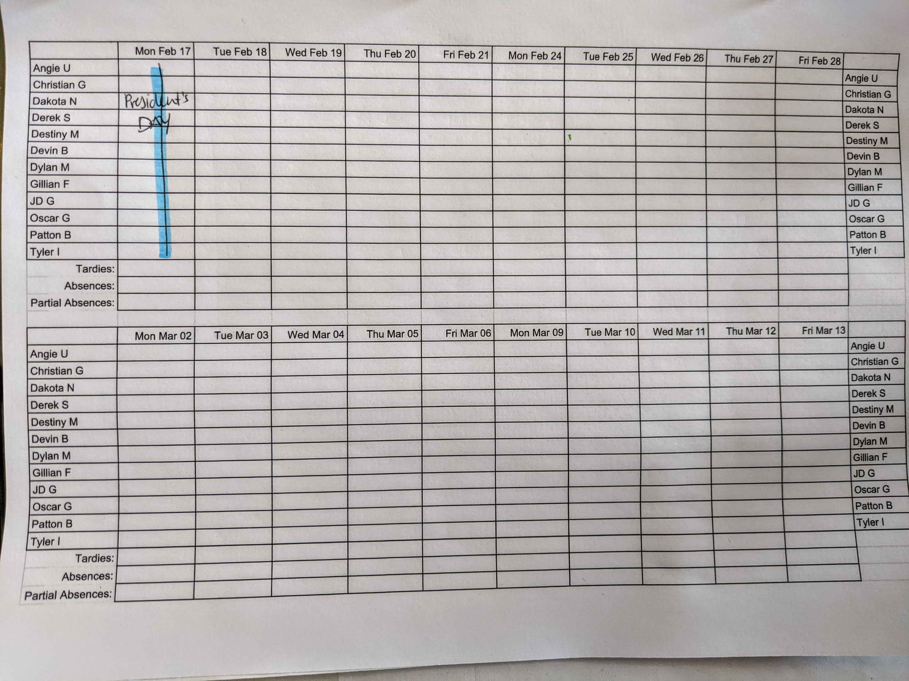

# Java Benchmark - BCCA Attendance

For this benchmark you are building software to automate attendance tracking at Base Camp Coding Academy. Currently students check in by marking on the form pictured below.

This form allows the academy to track student attendance. Your job is to turn this form into an application. Instead of filling out this form, Base Camp Coding Academy wants to put a computer in the classroom with a program that allows students to mark their arrival to class. Reference the form pictured above to determine what data is necessary from the user.

## Requirements

A student should be able to check in to mark their attendance.

Your code should be readable.

Your applications should be usable.

## Levels of Success

- **Needs Improvement**
  - Students can check in, but the data isn't stored between program executions.
- **Meets Expectations**
  - Students can check in, and the data is stored between program executions.
- **Exceeds Expectations**
  - A separate application is developed for instructors:
    - Instructors can view who is present, tardy, and absent for that day.
    - Instructors can view tardies and absences for a particular student.

## Submission

Email Sean, Nate, and Fernae a link to the Github repository containing your solution.
